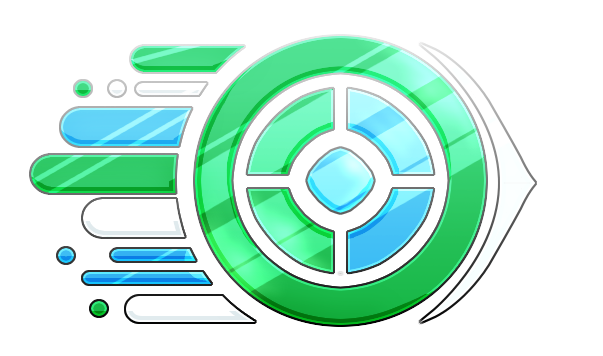

<h1>Neuw</h1>

Neuw is an in-development project bootstrapper that utilizes dynamic templates with embedded scripts to generate a
file and folder structure to hit the ground running with in a new project.

## So, what's in development?

The core of the application is implemented, and the remaining effort will be dedicated towards creating a JSON template
parser and an online platform to create and share templates.